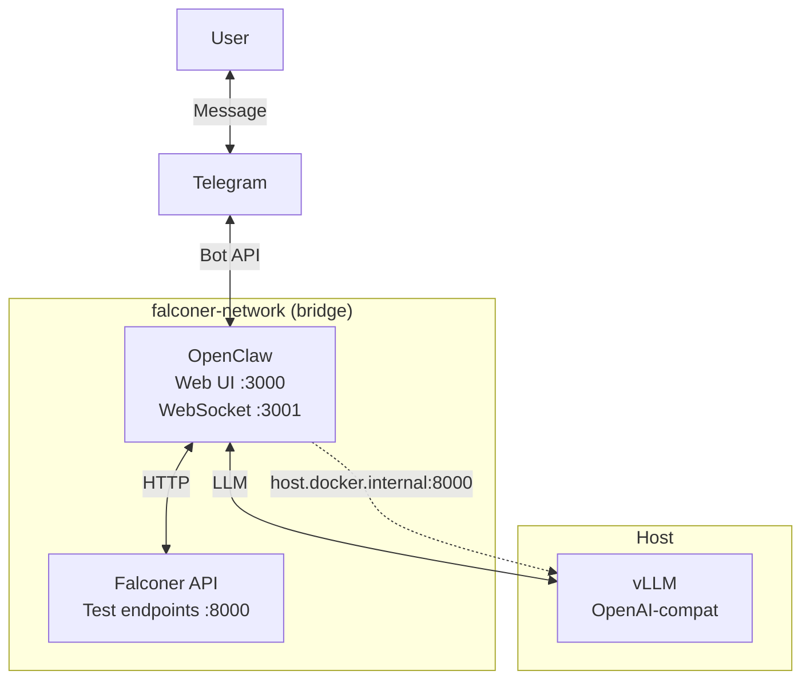

# OpenClaw PoC Architecture

System architecture and component interaction for the Falconer–OpenClaw integration proof-of-concept.

## System Architecture

## Component Interaction

- **User** interacts via **Telegram** (and optionally **Web UI**).
- **OpenClaw**:
  - Receives messages from Telegram (and Web UI).
  - Calls **vLLM** on the host for LLM responses (OpenAI-compatible API).
  - Calls **Falconer API** for fee brief and other test endpoints.
- **Falconer API** serves test-only endpoints; it does not perform real Bitcoin operations.

## Security Boundaries

- OpenClaw runs in a **separate container**; no direct access to Falconer core (Bitcoin RPC, Electrs, LNbits).
- **Falconer API** is a minimal FastAPI app with mock/test endpoints only.
- **Telegram** access is restricted by `TELEGRAM_ALLOWED_USERS`.
- Secrets live in **environment variables** (e.g. `.env.openclaw`); not committed.

## Data Flow

1. **Telegram → OpenClaw**: User message is delivered to the bot.
2. **OpenClaw → vLLM**: OpenClaw may request an LLM completion.
3. **OpenClaw → Falconer API**: OpenClaw calls e.g. `GET /api/test/fee-brief`.
4. **Falconer API → OpenClaw**: JSON response (mock fee data).
5. **OpenClaw → vLLM**: Optional formatting/summary with LLM.
6. **OpenClaw → Telegram**: Reply sent to the user.

## Network Topology

- **Network**: `falconer-network` (bridge).
- **Services**: `openclaw`, `falconer-api` on this network.
- **Host access**: Containers use `host.docker.internal` to reach vLLM on the host (Mac/Windows).

See [openclaw-setup.md](openclaw-setup.md) for setup and [openclaw-api.md](openclaw-api.md) for API details.
